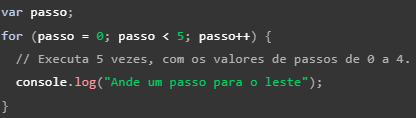
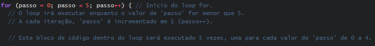
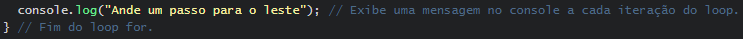
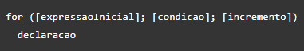
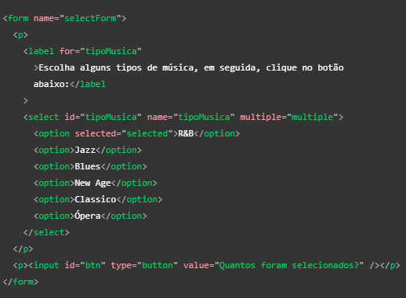
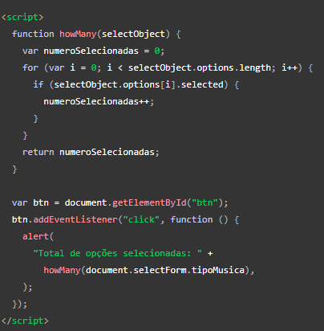
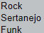
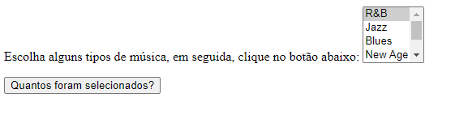

# Implementação de Laço e Iterações 

# Introdução - Código exemplo antes das alterações

# O código exemplo de laços e iterações foi originado de [MDN web docs_](https://developer.mozilla.org/pt-BR/docs/Web/JavaScript/Guide/Loops_and_iteration).
 - O JavaScript suporta um conjunto compacto de declarações, especificamente de fluxo de controle, que você pode utilizar para atribuir uma grande interatividade a páginas web. Este link citado anteriormente fornece uma visão geral destas declarações.

# Laços oferecem um jeito fácil e rápido de executar uma ação repetidas vezes. *Exemplo abaixo* 👇.

# Agora são todas funções deste código citado anteriormente acima ☝️.

## Var

## For 

## Console.log

# Declaração For 

### Um laço *for* é repetido até que a condição especificada seja falsa. O laço for no JavaScript é similar ao Java e C. Uma declaração for é feita da seguinte maneira ⬇️.

# Quando um for é executado, ocorre o seguinte: 

1. A expressão *expressao Inicial* é inicializada e, caso possível, é executada. Normalmente essa expressão inicializa um ou mais contadores, mas a sintaxe permite expressões de qualquer grau de complexidade. Podendo conter também declaração de variáveis.

2. A expressão *condicao* é avaliada. caso o resultado de *condicao* seja verdadeiro, o laço é executado. Se o valor de *condicao* é falso, então o laço terminará. Se a expressão *condicao* é omitida, a *condicao* é assumida como verdadeira.

3. A instrução é executada. Para executar múltiplas declarações, use uma declaração em bloco ({ ... }) para agrupá-las.

4. A atualização da expressão *incremento*, se houver, executa, e retorna o controle para o passo 2.

# Exemplo 

 A função a seguir contém uma declaração *for* que contará o número de opções selecionadas em uma lista (um elemento *select* permite várias seleções). Dentro do *for* é declarado uma váriavel *i* inicializada com zero. A declaração *for* verifica se *i* é menor que o número de opções no elemento *select*, executa sucessivas declaração *if*, e incrementa *i* de um em um a cada passagem pelo laço. 👇

 

# Código depois de todas as alterações

 - Os 3 genêros musicais que foram incrementados no código citado anteriormente. Sendo eles Rock, Sertanejo e Funk.

 - 

## As estilizações que foram realizadas em comparação com o código puro

### Código Puro 

### Código Estilizado

# Conclusões Finais

 - Implementação do código exemplo de laços e iterações, possibilitaram selecionar mais 3 gêneros musicais e também a estilização dos campos de inserção como o elemento "input", os campos para a seleção dos gêneros musicais foi alterado nas bordas e cores.

 - Além de simplificar o código e facilitar a manutenção, os laços e iterações também ajudam a reduzir a redundância, garantindo consistência e precisão nos dados exibidos. Eles oferecem uma abordagem mais eficiente para lidar com conjuntos de dados variáveis ​​e dinâmicos, permitindo que os desenvolvedores se concentrem em lógicas mais complexas e na criação de recursos interativos. Isso resulta em uma experiência do usuário mais envolvente e satisfatória, promovendo assim uma melhor interação e fidelidade dos usuários com o site ou aplicativo web.

# Tecnologias Utilizadas 

## [MDN web docs_](https://developer.mozilla.org/pt-BR/docs/Web/JavaScript/Guide/Loops_and_iteration)

## [W3schools](https://www.w3schools.com/js/) (JS)

## [w3schools](https://www.w3schools.com/Css/) (CSS)

## [Pipz](https://docs.pipz.com/central-de-ajuda/learning-center/guia-basico-de-markdown#open)

## [jsFiddle](https://jsfiddle.net/)

## [DIO articles](https://www.dio.me/articles/guia-para-organizacao-de-layout-em-html-dicas-e-melhores-praticas)

## [TreinaWeb](https://www.treinaweb.com.br/blog/css-grid-um-guia-interativo-parte-1-containers)

## [Alura](https://www.alura.com.br/artigos/css-grid-guia-propriedades-grid-container-grid-item)

# Autores 

